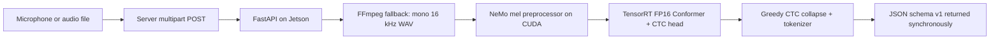

# Parakeet CTC Vietnamese TensorRT on Jetson Orin NX

An inference-only Vietnamese ASR pipeline for NVIDIA Jetson Orin NX. It exports
`nvidia/parakeet-ctc-0.6b-Vietnamese` from NeMo to ONNX, builds an FP16 TensorRT
engine on the target Jetson, keeps the runtime warm behind FastAPI, accepts
browser-style WebM/Opus or regular audio files, and returns a stable JSON v1
response.

The repository contains source code, reproducible test fixtures, raw build and
validation logs, and benchmark reports. Model checkpoints, ONNX files and
TensorRT engines are intentionally excluded because they are large and
device/runtime-specific.

## Verified target

- NVIDIA Jetson Orin NX 16 GB
- Ubuntu 22.04 / L4T 36.4.3
- NVIDIA PyTorch container `25.06-py3-igpu`
- PyTorch `2.8.0a0+5228986`, container CUDA 12.9, cuDNN 9.10.2
- NeMo 2.7.3
- TensorRT 10.11.0.33 for the deployed engine
- Model revision `b0493142b49458810324e3db8be9e8e07b4ebc17`
- Batch 1 profile: 16 to 2,000 mel frames (optimum 500)

TensorRT plan files are not portable across arbitrary GPU models or TensorRT
versions. Rebuild the engine on the deployment Jetson when either changes.

## Result

The acceptance fixture is 4.64 seconds of Vietnamese audio encoded as WebM/Opus.

| Measurement | Result |
|---|---:|
| Client end-to-end | 191.6 ms |
| Server end-to-end | 183.5 ms |
| FFmpeg normalization | 113.4 ms |
| TensorRT inference | 54.8 ms |
| Target | < 1,500 ms |
| Acceptance | **PASSED** |

The latency starts when upload begins after recording is complete. It does not
include the time during which the user is speaking or Internet latency between
an external server and the Jetson. See [reports/BENCHMARKS.md](reports/BENCHMARKS.md)
for all measured baselines, graph benchmarks and validation evidence.

## Architecture



The server sends audio only when it is ready to wait for the result. No callback,
polling, WebSocket or job database is required for the basic flow.

## Repository layout

- `workspace/`: model inspection, export, TensorRT runtime, API and validation tools
- `docker/`: reproducible NeMo inference and FastAPI images
- `examples/`: Python HTTP client for the application server
- `audio/`: small WAV and WebM acceptance fixtures
- `test_data/`: mel input, reference logits, trtexec output and metadata
- `outputs/`: PyTorch, TensorRT and HTTP JSON results
- `reports/`: raw build/validation logs and benchmark summary
- `docs/SERVER_INTEGRATION.md`: detailed server integration and operations guide

## Build the images

Docker and NVIDIA Container Runtime must already work on the Jetson.

```bash
sudo docker build --network=host \
  -t parakeet-asr:nemo-2.7.3-jetson \
  -f docker/Dockerfile .

sudo docker build --network=host \
  -t parakeet-asr:api-trt1011 \
  -f docker/Dockerfile.api .
```

Place the downloaded `.nemo` checkpoint under `cache/huggingface/`. The expected
model and revision are listed above. The checkpoint SHA-256 used for these tests
was `b1df1b01d9e833ca15930e29d0f2834a1668701dd40b11b573b04c3cfcca3a42`.

## Export and build

`workspace/export_onnx.py` exports the NeMo graph with opset 17. The original
export uses many external tensor files; `workspace/pack_onnx.py` repacks them
into one `.onnx` plus one `.onnx.data` file.

Build the final engine inside the TensorRT 10.11 container with this profile:

```bash
/opt/tensorrt/bin/trtexec \
  --onnx=/workspace/onnx_packed/parakeet_ctc_vi_fp32.onnx \
  --saveEngine=/workspace/engines/parakeet_ctc_vi_fp16_trt1011.engine \
  --minShapes=audio_signal:1x80x16,length:1 \
  --optShapes=audio_signal:1x80x500,length:1 \
  --maxShapes=audio_signal:1x80x2000,length:1 \
  --fp16 \
  --memPoolSize=workspace:4G \
  --builderOptimizationLevel=3 \
  --skipInference
```

The raw successful build command and output are preserved in
`reports/build_tensorrt_fp16_trt1011.log`.

## Run the persistent API

Create a private environment file outside the repository:

```bash
mkdir -p "$HOME/.config/parakeet-asr"
chmod 700 "$HOME/.config/parakeet-asr"
cp .env.example "$HOME/.config/parakeet-asr/api.env"
chmod 600 "$HOME/.config/parakeet-asr/api.env"
```

Replace the placeholder token with `openssl rand -hex 32` and set the exact
checkpoint revision. Never commit `api.env`.

```bash
sudo docker run -d \
  --name parakeet-asr-api \
  --restart unless-stopped \
  --runtime=nvidia \
  --network=host \
  --shm-size=4g \
  --ulimit memlock=-1 \
  --ulimit stack=67108864 \
  --user "$(id -u):$(id -g)" \
  --env-file "$HOME/.config/parakeet-asr/api.env" \
  -v "$PWD:/workspace" \
  parakeet-asr:api-trt1011 \
  uvicorn asr_api:app \
    --app-dir /workspace/workspace \
    --host 127.0.0.1 \
    --port 8770 \
    --workers 1
```

Use one Uvicorn worker: each worker would otherwise load another engine and GPU
runtime. Confirm readiness with `curl http://127.0.0.1:8770/health`.

## Server client

```bash
python3 -m pip install -r examples/requirements.txt
export ASR_URL=http://127.0.0.1:8770/transcribe
export ASR_API_TOKEN='<secret>'
python3 examples/server_submit_audio.py \
  audio/test_vieneu_microphone.webm \
  --output outputs/api/server-response.json
```

For production networking, authentication, response handling and retry rules,
read [docs/SERVER_INTEGRATION.md](docs/SERVER_INTEGRATION.md).

## Limits

- Batch size is 1.
- Maximum upload size is 25 MiB.
- The current TensorRT profile accepts up to 2,000 mel frames, approximately
  20 seconds of audio.
- Inference requests are serialized with an async lock. Queue time is returned
  in the response.
- Greedy CTC decoding can phoneticize unfamiliar product names such as VieNeu,
  Jetson and Orin; TensorRT validation still produced identical collapsed token
  IDs to the PyTorch reference for the fixture.

## Upstream terms

The NVIDIA container, NeMo toolkit and Parakeet checkpoint remain subject to
their respective upstream licenses and terms. No model weights or NVIDIA binary
artifacts are redistributed in this repository.
